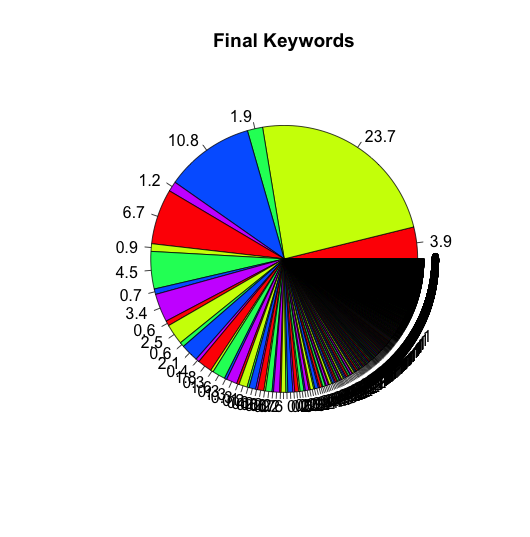

# People To People Recommendation

## Basic info

### Language:

- R : Statistics, Generate Graph
- Javascript: MongoDB Map-reduce
- Python: Token Normalization

### Prepraed Data

- Data Size: 2289109
- DB : MongoDB

### Used Categories of People

- Skills
- Positions
- Educations
- Compony or College Names

## Steps

### 1. Clean Data

1. Remove invalid characters
2. Lower case words
3. Word Tokenizer
4. Token Normalization

### 2. Generate Keywords

### 3. Caculate weight of the keywords in each category.

1. Method: TF * IDF
2. Example: 
 
Heighest Weight

| Keyword | market |microsoft |develop | busy| plan | analys | off | 
|:---:|:---:|:---:|:---:|:---:|:---:|:---:|:---:|
| Count | 52188 | 52555 | 50644 | 44146 | 42731 | 38805 | 37878 | 
| Weight |36.785665 |36.781846 |36.781428 |36.382975 |36.209036 |35.547924 |35.351517 |

Lowest Weight

| Keyword | c8 |conceptualización |cu | f3| fc | 00 | 2h | 
|:---:|:---:|:---:|:---:|:---:|:---:|:---:|:---:|
| Count | 3 | 3 | 3 | 3 | 3 | 3 | 3 | 
| Weight |0.012231 |0.012231 |0.012231 |0.012231 |0.012231 |0.012231 |0.012231 |0.012231 |

### 4. Improve: For Cold start problem: Same Meaning Words (a way to fixed cold start problem).
    
+ If one person has just a few keywords, it is hard to recommendate people to them.
+ We generated same Meaning Words for them.
+ If two words appears together so frequency, we came assume they are same meaning.
+ In different categories, we have different same meaning words.

### 5. Repeat Step From 1-4 In Four category
  - We believe different keywords in different categories should have different weight.

### 6. Use category.keyword to represent every people
  - Every people is a vector represent by keywords {...}[0 or weight]
  - Example: person = {category1.keyword1, category1.keyword2,...category3.keyword4,...categoryN.keywordM}

### 7. Calculation the similarity of people to each other
  - Use ”cosine similarity” to calculate similarity
  - Each pair of people only compare once. We can use to method to do:
    + Use graph to figure out what should we do
    + Use book[] to book the pair have been compared

### 8. Store all the information into a table.
