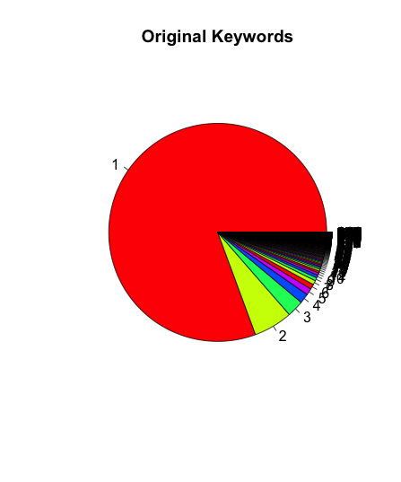
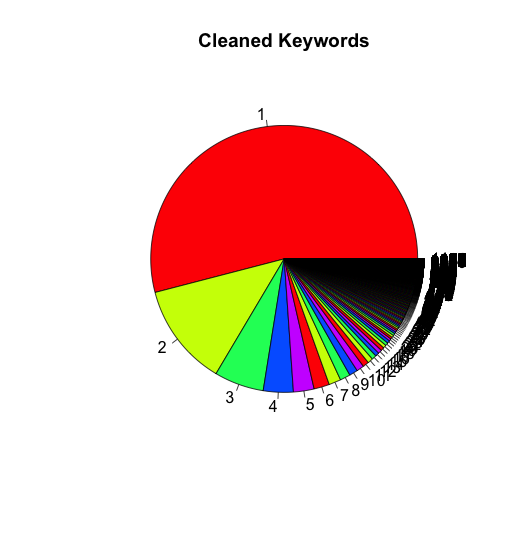
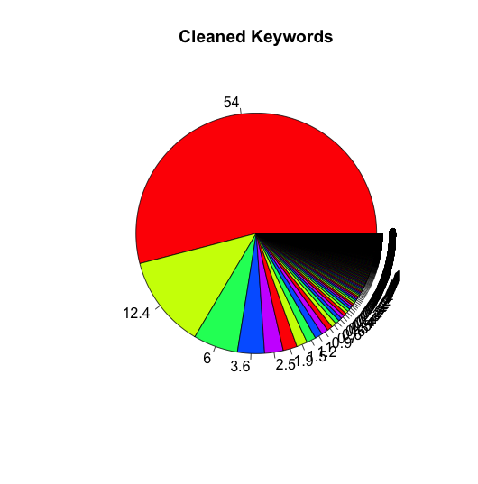

# Clean Data

## We use the properties of skills to be keywords.
- Method: Use map-reduce to generate data from mongodb.
- Result: 
    
    ```json
    {
            "result" : "skills",
            "timeMillis" : 108007,
            "counts" : {
                "input" : 2289109,
                "emit" : 1925879,
                "reduce" : 329585,
                "output" : 166294
            },
            "ok" : 1
    }
    ```
- Generated data example:

    ```json
    {
        "_id" : "\"Human Resource\"",
        "value" : 1
    }
    {
        "_id" : "\"Hunter & Farmer\" mentalities",
        "value" : 1
    }
    ```
        
- Issue: Lots of descripions were long, can not match each other.
    
    | Count | Percent | Description |
    | :---: | :---: |:---|
    | 1     | 80.6% | 80.6% keywords only appear once |
    | 2     | 5.8%  | 5.8% of keywords appear twice |
    | 3     | 1.4%  | 1.4% of keywords appear three time |
    |other  | 12.2% | other keywords total appear 12.2% |
    
    <div style="text-align: center">
    	
    	
    </div>
    
- Solution:
    + Use NLP method to clean the data.

## Use Natural Language Processing method to `Clean Data`
- Remove the invalid character. Like: "\, &, $, %"
    
    ```json
    {
        "_id" : "Human Resource",
        "value" : 1
    }
    {
        "_id" : "Hunter Farmer mentalities",
        "value" : 1
    }
    ```
    
- `Lower Case Words`, like: DATA, DAta, Data --&gt; data
    
    ```json
    {
        "_id" : "human resource",
        "value" : 1
    }
    {
        "_id" : "hunter farmer mentalities",
        "value" : 1
    }
    ```
        
- `Word Tokenizer`
        
    ```json
    {
        "_id" : "human",
        "value" : 1
    }
    {
        "_id" : "resource",
        "value" : 1
    }
    {
        "_id" : "hunter",
        "value" : 1
    }
    {
        "_id" : "farmer",
        "value" : 1
    }
    {
        "_id" : "mentalities",
        "value" : 1
    }
    ```

- Result:

    ```json
    {
	    "result" : "cleaned-skills",
	    "timeMillis" : 18601,
	    "counts" : {
		    "input" : 166294,
		    "emit" : 538772,
		    "reduce" : 94900,
		    "output" : 71941
	    },
	    "ok" : 1
    }
    ```
    
    | Count | Percent | Description |
    | :---: | :---: |:---|
    | 1     | 57.7% | 57.7% keywords appear once |
    | 2     | 11.7%  | 11.7% of keywords appear twice |
    | 3     | 5.5%  | 5.5% of keywords appear three time |
    |other  | 25.1% | other keywords total appear 25.1% |
    
    <div style="text-align: center">
    	
    	
    </div>
    
    
- `Token Normalization` like: mining, mined --&gt; mine
    
    ```json
    {
        "_id" : "mentalities",
        "value" : 1
    }
    {
        "_id" : "mental",
        "value" : 1
    }
    ``` 
    
- After that:
    + "DAta mining", "Data Mined", "Mining DATA" --&gt; data, mine
- Result:
	
	```json
	{
		"result" : "stem_skills",
		"timeMillis" : 6013,
		"counts" : {
			"input" : 71941,
			"emit" : 71941,
			"reduce" : 8062,
			"output" : 55065
		},
		"ok" : 1
	}
	```

	| Count | Percent | Description |
    | :---: | :---: |:---|
    | 1     | 57.7% | 57.7% keywords appear once |
    | 2     | 11.7%  | 11.7% of keywords appear twice |
    | 3     | 5.5%  | 5.5% of keywords appear three time |
    |other  | 25.1% | other keywords total appear 25.1% |
    
    <div style="text-align: center">
    	
    	
    </div>
