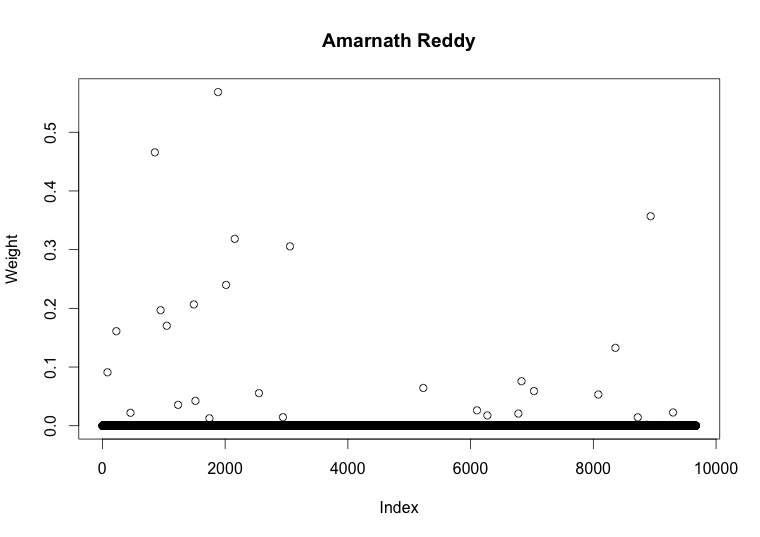
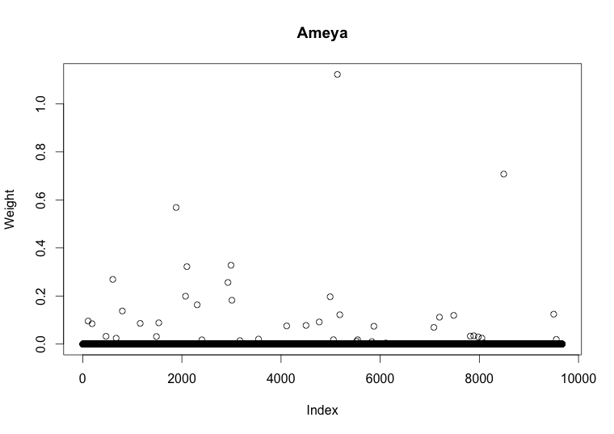
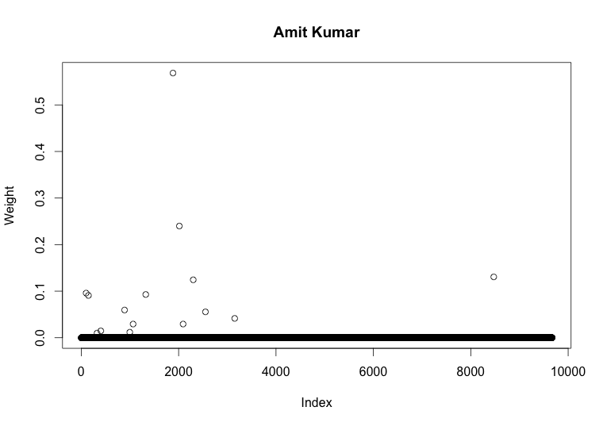
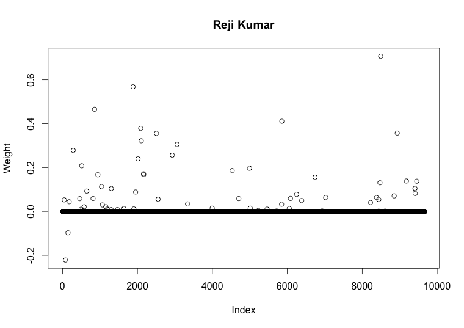

# People represent by keywords

#### Use keywords to represent peopel

1. keywords count: 9672
2. people count: 5167

#### feature of the data

- some people have more keywords, some have less
- keywords sparse

#### Example:

